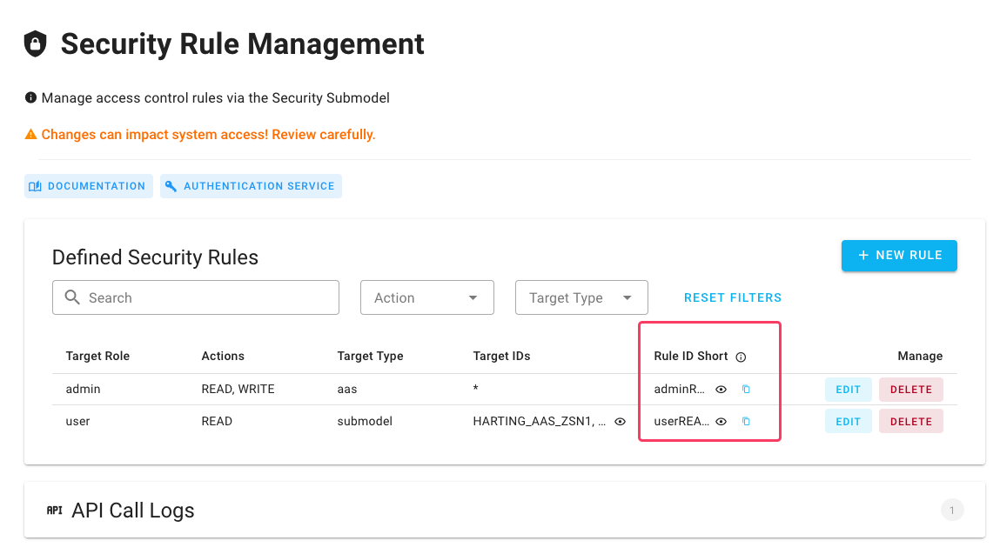

# RuleID Short

<figure><figcaption>
In dieser Spalte sehen sie base64-codierte RuleID
</figcaption></figure>

* Mit einem Klick auf den "Auge"-Button können Sie die gesamte ID anzeigen
* Mit einem Klick auf das "Kopieren"-Symbol können Sie die ID in Ihre Zwischenablage kopieren
